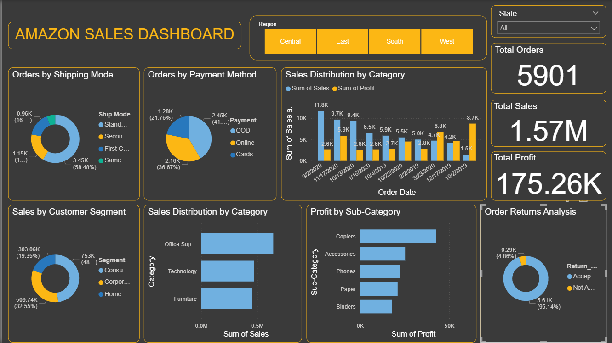

# amazon-sales-dashboard
Interactive Power BI dashboard analyzing sales, profit, and customer trends

# 📊 Amazon Sales Dashboard

## 📌 Project Overview

This project presents an interactive **Amazon Sales Dashboard** built using Power BI to analyze sales performance, profitability, and customer behavior. The dashboard enables users to explore key business metrics and gain actionable insights through dynamic visualizations and filters.

---

## 🚀 Key Features

* 📦 **Total Orders, Sales, and Profit KPIs**
* 📈 **Sales & Profit Trend Over Time**
* 🧩 **Sales Distribution by Category and Segment**
* 💰 **Profit Analysis by Sub-Category**
* 🚚 **Orders by Shipping Mode**
* 💳 **Orders by Payment Method**
* 🔁 **Order Returns Analysis**
* 🌍 **Region and State Filters for dynamic insights**

---

## 🛠️ Tools & Technologies

* Power BI
* Microsoft Excel / CSV Dataset

---

## 📷 Dashboard Preview

---

## 📊 Key Business Insights

* 📍 **West region** generates the highest sales among all regions
* 🖨️ **Copiers category** contributes the highest profit
* 💳 **Cash on Delivery (COD)** is the most preferred payment method
* 📦 Majority of orders are **successfully delivered with minimal returns**
* 📊 Technology and Office Supplies categories show strong performance

---

## 📂 Project Structure

amazon-sales-dashboard/
│
├── Amazon Sales Dashboard.pbix
├── dataset.csv
├── dashboard.png
└── README.md

---

## ⚙️ How to Use

1. Download the `.pbix` file from this repository
2. Open it using **Power BI Desktop**
3. Interact with filters (Region, State)
4. Explore insights using charts and KPIs

---

## 🎯 Project Objective

The goal of this project is to:

* Demonstrate **data visualization and dashboard design skills**
* Perform **business data analysis**
* Extract **meaningful insights from sales data**
* Build a **real-world portfolio project for job applications**

---

## 👨‍💻 Author

**Mohamed Riyaz M**
📧 Email: [riyaz312005@gmail.com](mailto:riyaz312005@gmail.com)
🔗 LinkedIn: https://www.linkedin.com/in/mohamed-riyaz31

---

## ⭐ If you found this project useful

Give it a ⭐ on GitHub and feel free to connect with me!
